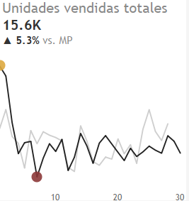
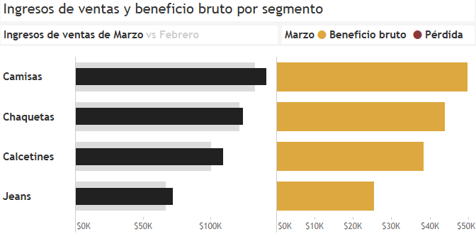
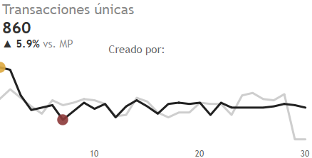

# Análisis del rendimiento de ventas de Balanced Tree Clothing Company

## Antecedentes del Proyecto

La compañía Balanced Tree Clothing, ofrece una gama amplia de ropa para el estilo de vida del aventurero moderno. Danny, 
el CEO de esta moderna empresa de moda, necesita apoyo para los equipos de mercadotecnia al analizar 
el rendimiento de ventas y generar un informe financiero básico.

Este proyecto analiza los datos de ventas para determinar el rendimiento de ventas y ajustar la 
estrategia de la empresa si es necesario.

Las ideas y recomendaciones se presentan en las siguientes áreas clave:

- Análisis de alto nivel: Proporciona una visión general de alto nivel sobre el rendimiento de ventas de 
la empresa, incluyendo métricas financieras de manera mensual y diaria.

- Análisis de transacciones: Analiza los datos relacionados con transacciones, incluyendo transacciones únicas, 
promedio de productos únicos comprados en cada transacción, valor promedio de descuento por transacción, etc.

- Análisis de productos: Analiza los datos relacionados con productos, incluyendo la cantidad total, 
los ingresos y los descuentos para cada segmento, el producto más vendido para cada segmento, el producto 
más vendido para cada categoría, etc.

## Estructura de datos y verificaciones iniciales

El conjunto de datos (base de datos) presenta 2 tablas. La primera, llamada **product_details**, incluye toda la información del inventario disponible en la tienda. El segundo, **sales**, contiene información de todas las transacciones (ventas) realizadas, incluyendo cantidad, precio, 

descuento (%), tipo de membresía, ID de transacción y también la marca de tiempo de la transacción. Estos datos abarcan el primer trimestre de 2021. Las tablas contienen 12 y 15,095 observaciones respectivamente o 15,107 en total.

El esquema de la base de datos puede ser encontrado [aquí](https://github.com/cjmj96/balanced-tree-clothing-co-case-study/blob/spanish/code/balanced_tree_clothing_co_schema.sql)

## Resumen Ejecutivo

### Visión general de descubrimientos

Las ventas del último mes (marzo de 2021) muestran un desempeño positivo en diferentes métricas de salud financiera si se compara a meses anteriores en el mismo trimestre. Las métricas utilizadas fueron **total de unidades vendidas**, **ingresos totales por ventas**, **ingresos netos por ventas** y **ganancia bruta**. Las siguientes secciones explorarán esto en mayor detalle. 

Los resultados se presentan en varios dashboards, que se encuentran [aquí](https://public.tableau.com/views/AnlisisdeVentasparalacompaaBalancedTreeClothing/Analisisdealtoniveldashboard?:language=en-US&publish=yes&:sid=&:redirect=auth&:display_count=n&:origin=viz_share_link).

Las consultas de PostgreSQL que se utilizaron para realizar los análisis están disponibles en el directorio **/codigo**, específicamente en estos enlaces de Github: [Análisis de alto nivel](https://github.com/cjmj96/balanced-tree-clothing-co-case-study/blob/spanish/code/analisis_de_alto_nivel.sql), [Análisis de transacciones](https://github.com/cjmj96/balanced-tree-clothing-co-case-study/blob/spanish/code/analisis_de_transacciones.sql), y [Análisis de productos](https://github.com/cjmj96/balanced-tree-clothing-co-case-study/blob/spanish/code/analisis_de_productos.sql).

### Análisis de alto nivel

#### Unidades totales vendidas

En marzo, la cantidad de unidades vendidas fue de 15,608, un aumento del 5.3% (+788 unidades) en comparación con febrero. (14,820). Esta tendencia también es evidente en el aumento del 5.5% desde enero.

#### Ingresos totales por ventas

En marzo, los ingresos totales por ventas alcanzaron los $447,227, un aumento del 6.1% respecto a febrero ($421,554). Este patrón de crecimiento constante también se observa en el aumento del 6.3% desde enero.

#### Ingresos por ventas netas

En marzo, los ingresos netos por ventas ascendieron a $394,248, un aumento del 6.6% respecto a febrero ($421,554). Este patrón de crecimiento constante también se observa en el aumento del 6.8% desde enero.

#### Monto total del descuento

En marzo, el monto total de descuentos alcanzó los $52,978, un aumento del 2.5% respecto a febrero ($51,661). Este patrón de crecimiento constante también se observa en el aumento del 2.6% desde enero.

#### Beneficio bruto

En marzo, el beneficio bruto ascendió a $157,699, un aumento del 6.6% respecto a febrero ($147,957). Este patrón de crecimiento constante también se observa en el aumento del 6.8% desde enero.

#### Ingresos por ventas y beneficio bruto por segmento

Las camisas fueron las líderes tanto en ingresos por ventas como en ganancias, con $141,500 y $49,800, respectivamente. Esto representó un aumento del 6.4% en los ingresos y un aumento del 6.7% en las ganancias desde febrero, así como un crecimiento considerable del 7.52% y del 7.7% en ambas métricas desde enero.

### Análisis de transacciones

#### Transacciones únicas

Marzo tuvo 860 transacciones, un aumento del 5.9% en comparación con febrero. (812). Este patrón de crecimiento constante también se observa en el aumento del 3.86% desde enero. (828).

#### Promedio de productos únicos por transacción

En marzo, los clientes compraron un promedio de 6.5 artículos distintos por transacción, una disminución del 1% en comparación con febrero. (6.6). Este patrón es inexistente (6.5) en enero.

#### Valor promedio de descuento

En marzo, el valor promedio del descuento alcanzó un 11.8%, una disminución del 3.4% en comparación con febrero. Este patrón de disminución constante también se observa en la disminución del 4% desde enero.

#### División de transacciones para miembros vs no miembros

En marzo, las transacciones son realizadas principalmente por clientes miembros con un 59% (510), una tendencia consistente también observada en meses anteriores.

#### Ingresos promedio de ventas para miembros vs no miembros

En marzo, el ingreso promedio por ventas fue de $86 y $87 para miembros y no miembros, respectivamente. Estas cantidades se mantuvieron relativamente estables en los meses anteriores.

### Análisis de productos

#### Los 3 productos principales por ingresos de ventas (antes del descuento)

El mes de marzo, la Camisa Polo Azul ($75,000), la Chaqueta de Moda Gris ($71,000) y la camiseta blanca ($54,000) generaron los mayores ingresos. Este patrón de ventas fue similar al de febrero. Sin embargo, los rankings para esto fueron diferentes a los de enero, donde la chaqueta de moda gris se vendió más, seguida de cerca por la camiseta polo de color azul que ocupó la segunda posición.

#### Distribución de los ingresos por categoría (%)

En marzo, los productos para hombres seguían siendo la categoría líder con un 56% de participación en los ingresos totales de ventas. Este liderazgo, curiosamente, es el mismo para los últimos dos meses de febrero y enero.

#### Producto más vendido por categoría

Se ha observado que hubo algunas diferencias en los artículos de mayores ingresos mensuales tanto para hombres como para mujeres. En el caso de marzo, los calcetines de lunares fluorescentes rosas (1,367 unidades) y los jeans oversized azul marino (1,375 unidades) demostraron ser los grandes ganadores respectivamente. Las Camisas Polo Azules (1,281 unidades) en la categoría de Hombres registraron las ventas más altas en el mes de febrero, mientras que en la categoría de Mujeres fueron las Chaquetas de Traje Caqui (1,296 unidades) las que registraron las ventas más altas. Solo se registró un cambio en la categoría de Mujeres en enero, con las Chaquetas de Moda Grises siendo el producto líder (1,300 unidades), el producto Camisetas Polo Azules mantuvo su lugar. (1,264 units).

#### Combinación de 3 productos más frecuente en las transacciones

En marzo, la mezcla de productos más vendida incluyó unos Jeans Negros Rectos para Mujer, un par de Calcetines de Lunares Fluorescentes Rosados para Hombre y una Camiseta Blanca para Hombre, con 136 ventas registradas. Esta tendencia también fue evidente en el primer trimestre con dos productos constantes (Jeans y camiseta) y un tercer producto diferente cada mes: Chaqueta de traje caqui para mujer en febrero (112 ventas) y calcetines sólidos azul marino para hombre en enero. (117 sales).

#### Distribución de los ingresos por ventas por segmento por categoría (%)

En marzo, la distribución de ingresos indicó que las Camisas de Hombre lideraban con un 56.5%, mientras que los Calcetines seguían con un 43.5%; por otro lado, las Chaquetas de Mujer lideraban con un 63.2%, mientras que los Jeans retrocedían al 36.8%. En general, se observó el mismo patrón de distribución en el primer trimestre del año. (January-March).

#### Producto más vendido por segmento

En marzo, los artículos más vendidos fueron los Jeans en color marino (1,375 unidades) en Jeans, las Camisetas Blancas (1,346 unidades) en Camisas, las Chaquetas Elegantes Grises (1,322 piezas) en Chaquetas, y los Calcetines de Lunares Flúor Rosa (1,367 piezas) en Calcetines. Es interesante notar que febrero registró un cambio total en los productos más destacados en los diversos segmentos, con la única excepción de las camisetas blancas, cuyo rendimiento fue el mismo en enero.

#### Penetración de transacciones por producto

En cuanto a las ventas de la camiseta blanca para hombres, fue el centro de atención en marzo y, a través de ella, conquistó una penetración de mercado del 53%, superando al líder del mes anterior, las chaquetas de traje caqui, cuyo porcentaje de mercado se situaba en el 54%. Ya que se diferencia del líder del mercado este enero, que fueron los Jeans Relaxed Cream con un 52%.

#### Distribución de ingresos por ventas por producto por segmento

Se observó en los respectivos segmentos que había un patrón de ventas uniforme como en los meses anteriores. Curiosamente, en cada segmento, el producto líder era el que más ingresos generaba: Chaquetas de Moda Grises (57.5%) en la categoría de Chaquetas, Jeans Rectos Negros (58.5%) en la categoría de Jeans, Camisetas Polo Azules (53.3%) en la categoría de Camisas, y Calcetines Sólidos Marinos (44.1%) en la categoría de Calcetines, mientras que el segundo y tercer producto en los segmentos también tenían una participación de ingresos consistente.

## Recomendaciones

De los hallazgos resultantes del análisis se extraen las siguientes recomendaciones:

1. Optimización del rendimiento de ventas: Ampliar el inventario en la categoría de artículos de ropa masculina, especialmente en las camisas (polo azul) que aportan el 56% de los ingresos totales, asegurando al mismo tiempo grandes cantidades de los otros productos de compra habitual: chaquetas de moda grises.

2. Mejorar los márgenes: 

    2.1 Mantener la positiva revisión a la baja de las tasas de descuento (mejora de 3,4% en marzo) para mejorar el desarrollo de los márgenes.

    2.2 Crear estrategias de marketing únicamente centradas en recortes de precios del inventario con baja frecuencia de venta.

3. Gestion del inventario:

    3.1 Garantizar la disponibilidad de inventario de los tres productos más vendidos en conjunto: los jeans rectos negros, los calcetines lunares fucsias, la camiseta blanca, la chaqueta de traje caqui y el calcetín básico azul marino.

    3.2 Centrarse estratégicamente en la gestión de aquellos artículos que han tenido rendimiento medio en todos los segmentos en el trimestre examinado.

    3.3 La empresa debería descontinuar o rediseñar las categorías de artículos que tienen muy bajos niveles de tasas de penetración en las transacciones para maximizar su ROI.