# Analysis of Sales performance for Balanced Tree Clothing Company

## Project Background

Balanced Tree Clothing Company prides themselves on providing an optimised range of clothing and lifestyle wear for the modern adventurer!.

Danny, the CEO of this trendy fashion company has asked you to assist the team’s merchandising teams analyze their 
sales performance and generate a basic financial report to share with the wider business.

This project analyze data from products and sales to determine the sales performance of the company.

The insights and recommendations are given in the following key areas:

- High level analysis: Provides a high level overview about the sales performance of the company, including 
financial metrics on a monthly and daily basis.

- Transaction analysis: Analyze transaction-related data to extract KPIs, including unique transactions, 
average unique products purchased in each transaction, average discount value per transaction, etc.

- Product analysis: Analyze product-related data to extract KPIs, including total quantity, revenue and 
discount for each segment, top selling product for each segment, top selling product for each category, etc.

## Data structure and initial checks

The dataset (database) presents 2 tables. The first, called **product_details** includes information about the stock that 
Balanced Clothing sells in their store. The second, **sales** contains transaction information including quantity, price, 
percentage discount, member status, a transaction ID and also the transaction timestamp. The tables spans data from the Q1 of 2021. The 
tables contains 12 and 15,095 observations respectively or 15,107 in total.

The database schema can be found [here](https://github.com/cjmj96/balanced-tree-clothing-co-case-study/blob/main/code/balanced_tree_clothing_co_schema.sql).

## Executive Summary

### Overview of Findings

The sales of the current month (March 2021) exhibits positive performance in different financial health metrics compared to previous months (February and January). The metrics used were Total units sold, Total sales revenue, Net sales revenue and Gross profit. The following sections
will explore additional contributing factors and highlight key opportunity areas for improvement.

Below is the high level analysis page from the Tableau Dashboard and more examples are included throughout the report. The entire interactive dashboard can be viewed [here](https://public.tableau.com/views/FinancialSalesAnalysisforBalancedTreeClothingCompany/HighLevelAnalysisDashboard?:language=en-US&publish=yes&:sid=&:redirect=auth&:display_count=n&:origin=viz_share_link).

The following links contains all the PostgreSQL queries that we used in our sales analysis. These queries are available in the `/code` directory, specifically in these GitHub links: [High-Level Analysis](https://github.com/cjmj96/balanced-tree-clothing-co-case-study/blob/main/code/high_level_analysis.sql),[Transaction Analysis](https://github.com/cjmj96/balanced-tree-clothing-co-case-study/blob/main/code/transaction_analysis.sql), and [Product Analysis](https://github.com/cjmj96/balanced-tree-clothing-co-case-study/blob/main/code/product_analysis.sql).

### High Level Analysis

#### Total Units Sold

In March, the amount of units sold was 15,608, up by 5.3% (+788 units) from February (14,820). This trend is also apparent in the 5.5% increase from January.

#### Gross Sales Revenue

In March, the total sales revenue reached $447,227, up by 6.1% from February ($421,554). This consistent growth pattern is also observed in 
the 6.3% increase from January.

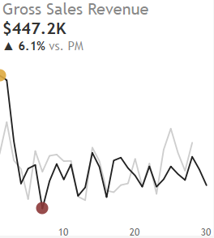

#### Net Sales Revenue

In March, the net sales revenue climbed to $394,248, up by 6.6% from February ($421,554). This consistent growth pattern is also observed in 
the 6.8% increase from January.

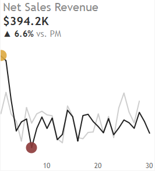

#### Total Discount Amount

In March, the total discount amount reached $52,978, up by 2.5% from February ($51,661). This consistent growth pattern is also observed in the 2.6% rise from January.

#### Gross Profit

In March, the gross profit climbed to $157,699, up by 6.6% from February ($147,957). This consistent growth pattern is also observed in the 6.8% increase from January.

#### Sales Revenue & Gross Profit by Segment

Shirts were the leader in both sales revenue and profit with $141,500 and $49,800, respectively. This represented a 6.4% increase in revenue and and 6.7% increase in profit from February, as well a considerable 7.52%, 7.7% growth in both metrics from January.

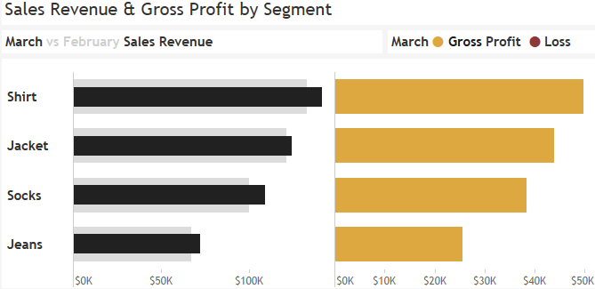

### Transaction Analysis

#### Unique Transactions

March had 860 transactions, up by 5.9% from February (812). This consistent growth pattern is also observed in the 3.86% increase from January (828).

#### Average Unique Products per Transaction

In March, customers bought an average of 6.5 distinct items per transactions, down by 1% from February (6.6). This pattern is inexistent (6.5) in January.

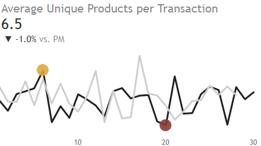

#### Average Discount Value

In March, the average discount value reached a 11.8%, down by 3.4% from February. This consistent decrease pattern is also observed in the 
4% decrease from January.

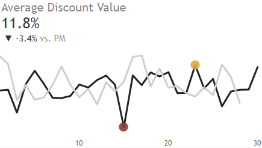

#### Transaction Split by client type

In March, the transactions are mostly done by member clients with a 59% (510), a consistent trend also observed in previous months.

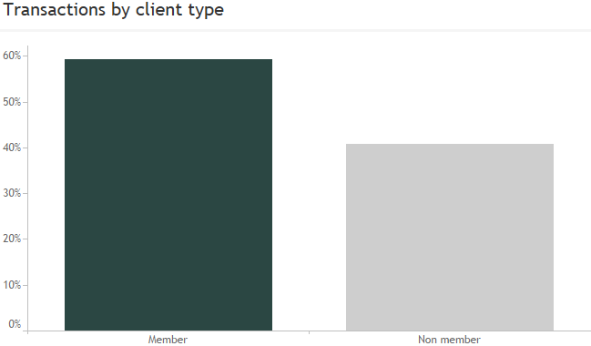

#### Average Gross Sales Revenue by client type

In March, the average sales revenue was $86 and $87 for member and non-member respectively. These amounts remained relatively stable in previous months.

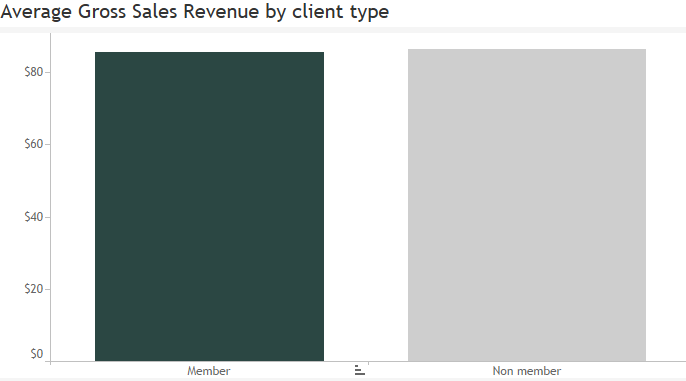

### Product Analysis

#### Top 3 Products by Gross Sales Revenue

The month of March, saw the Blue Polo Shirt ($75,000), the Grey Fashion Jacket ($71,000), and the white tees shirt ($54,000) generating the highest revenues. This pattern of sales was similar to that of February. However, the rankings for this were different for that of January, where the grey fashion jacket sold the most, followed closely by the blue polored polo shirt which took the second position.

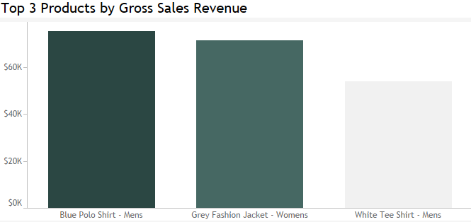

#### Most frequent 3-Product Combo in Transactions

In March, the top product mix included a Women’s Black Straight Jeans, a pair of Men’s Pink Fluorescent Polkadot Socks, and Men’s White T-shirt with 136 sales recorded. This trend was evident also in Q1 with two products constant (Jeans and T-shirt) and a different third product every month: Women’s Khaki Suit Jacket in February (112 sales) and Men’s Navy Solid Socks in January (117 sales).

#### Product penetration per Transaction

When it comes to the sales of the White Tee Shirt for men it was the center of attention in March and through it conquered a market penetration of 53% squeezing the previous month’s leader Khaki Suit Jackets whose market share stood at 54%. As it differs from the market leader this January who was the Cream Relaxed Jeans with 52%.

### Product analysis by Gender

#### Gross Sales Revenue by Gender

In March, Men’s products still were the leading category with 56% share of total sales revenue. This lead, interestingly, is the same for the last two months of February and January.

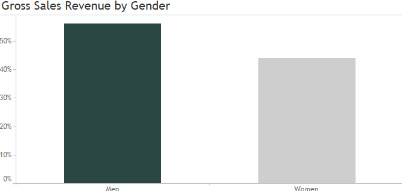

#### Top Product by Gender (quantity)

It has been observed that there were some differences in the montly top revenue earner items 
for both Men and Women. In the case of March came in, the Pink Fluro Polkadot Socks (1,367 units) 
and the Navy Oversized Jeans (1,375 units) proved to be the top winners respectively. The 
Blue Polo Shirts (1,281 units) in the Men category the highest sales recorded in the month 
of February while in the Women category was the Khaki Suit Jackets (1,296 units) which posted 
the highest unit sales. Only a change in the Women category was recorded in January with the 
Grey Fashion Jackets being the leading product (1,300 units), the Blue Polo Shirts product 
maintained their place (1,264 units).

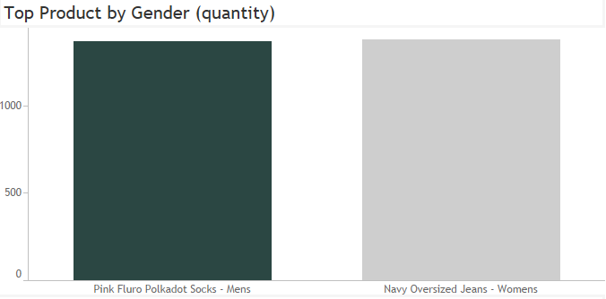

#### Gross Sales Revenue by Segment and Gender

In March, the revenue distribution indicated Men's Shirts leading at 56.5% while Socks followed at 43.5% meanwhile Women’s Jackets led at 63.2% while Jeans retreated at 36.8%. Generally, the same pattern of distribution was observed in the first quarter of the year (January-March).

### Segment analysis

#### Top Product by Segment (quantity)

In March, established performers were Navy Oversized Jeans (1,375 pieces) in Jeans, White Tee Shirts (1,346 pieces) in Shirts, Grey Stylish Jackets (1,322 pieces) in Jackets, and Pink Fluro Polka Dot Socks (1,367 pieces) in Socks. It is interesting to note that February registered a total turnaround in the top products in the various segments with the only exception of White Tee Shirts whose performance was the same in January.

#### Gross Sales Revenue by Segment

It was observed across the respective segments that there was a uniform sales pattern as in the earlier months. Interestingly, in every segment, the leading product was its top revenue garner: Grey Fashion Jackets (57.5%) in the Jackets category, Black Straight Jeans (58.5%) in the Jeans category, Blue Polo shirts (53.3%) in the Shirts category, and Navy Solid Socks (44.1%) in the Socks category, while the second and third products in the segments also had a consistent revenue share.

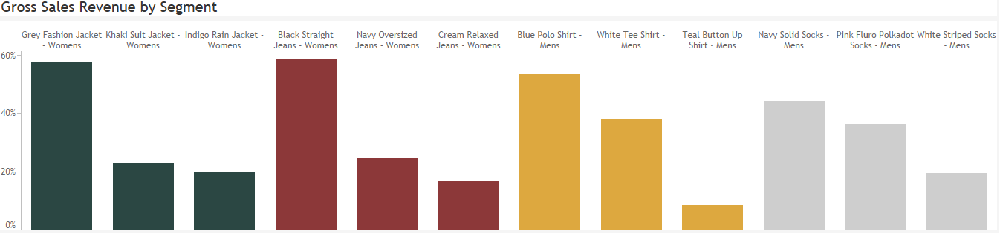

## Recommendations

In consideration of the findings derived from the case study, the following are important recommendations sorted by strategic areas: 

1. Optimizing Sales Performance: Prioritize extending the assortment of the category of men’s apparel,
   primarily shirts (Blue Polo), since they account for 56% of the overall revenues while equally 
   ensuring that there are high levels of stocks for other regular best-shopping items such as Grey Fashion Jackets.

2. Enhancing Profitability:

    2.1 There is a need to sustain the successful downward revision of 
    the discount rates (recorded March improvement of 3.4%) in order to
    enhance margin developments.

    2.2 Marketing strategies should concentrate on price cuts for slow
    moving stock only.

3. Inventory Management:
                                                 
     3.1 Continue to stock the highest selling three products which include 
     the Black Straigth Jeans, Pink Fluro Polkadot Socks, White Tee Shirt, 
     Khaki Suit Jacket, and Navy Solid Socks in relatively higher quantities. 

     3.2  Strategically concentrate on the management of products that have
    exhibited moderate performance across segments for the entire period.
    
     3.4 To maximize their return on investment, the company should either
    discontinue or redesign the product lines that command very low levels
    of transaction penetration rates.